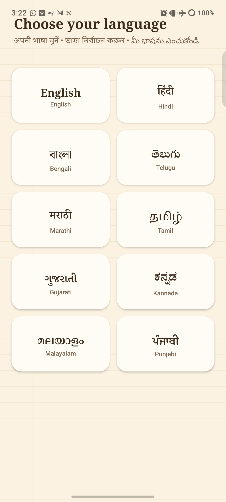
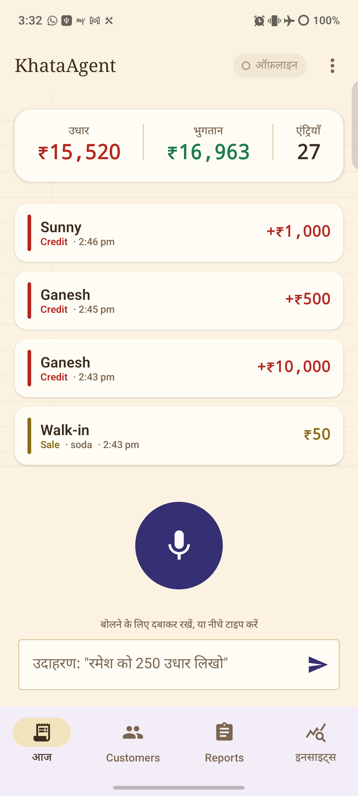
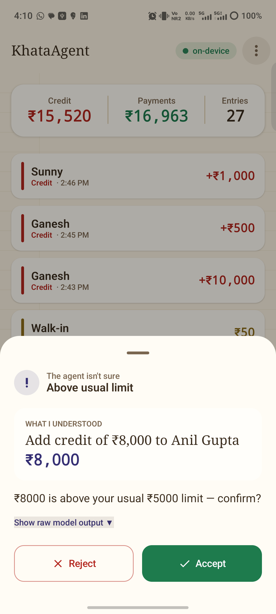
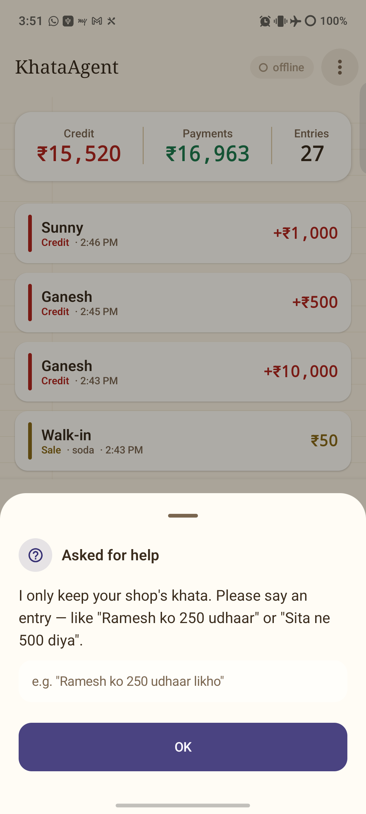
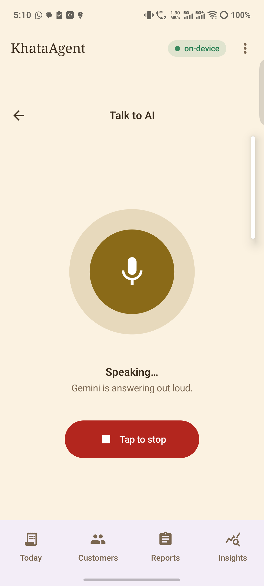
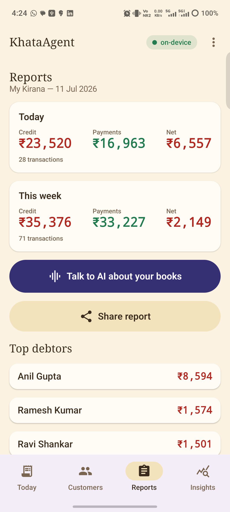
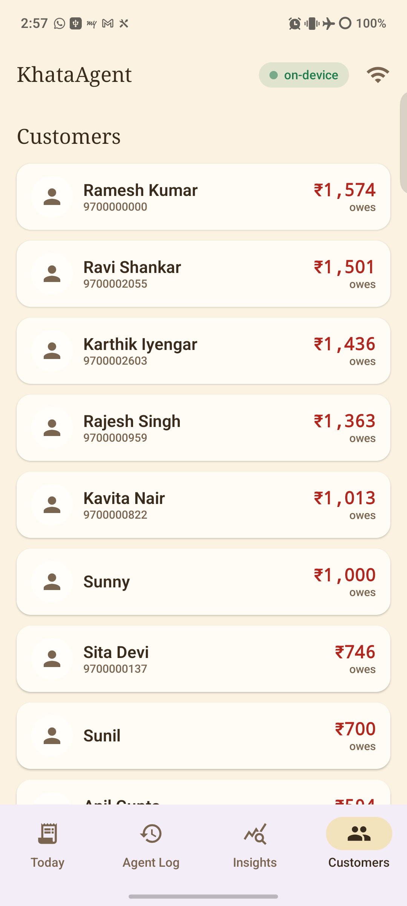
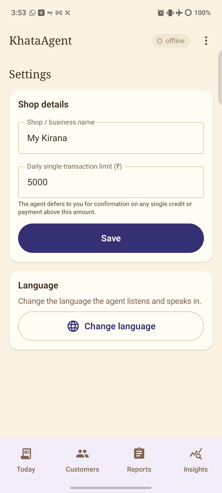
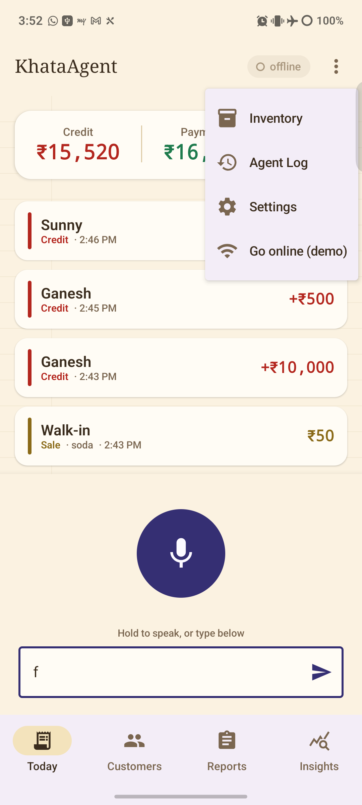

# 🧾 KhataAgent — the ledger agent that works where the internet doesn't

**An offline, voice-driven ledger + inventory agent for India's 13-million kirana (corner) stores — running Gemma 4 E2B fully on-device via LiteRT-LM.** Speak a transaction in Hindi/Kannada/English, and the agent parses it, validates it in code, writes it to SQLite, recovers from its own mistakes, and **defers to the shopkeeper when it's unsure** — all with the phone in airplane mode.

> **One-line pitch:** an agent that works where the internet doesn't, and knows exactly when it needs help.

### 🎥 60-second demo → **https://youtube.com/shorts/kKpmK_VZs9I**

**Tracks:** 🏆 Special Prize — *Best Use of Gemma 4 (Local-First Agents)* · 🤝 *Problem Statement 2 — Autonomous Orchestration* (via the cloud-escalation + live-AI layer).

---

## ⚡ Why it wins in 20 seconds

| | |
|---|---|
| 🔒 **100% offline core** | Gemma 4 E2B runs **on the phone's GPU** (OpenCL, ~50 tok/s). Airplane mode → still works. No cloud dependency for the ledger. |
| 🗣️ **Voice-first, 9 Indian languages** | Speak or type in Hindi, Tamil, Telugu, Kannada, Bengali, Marathi, Gujarati, Malayalam, Punjabi or English. The whole app localises. |
| 🧠 **Real agent loop** | sense → decide → act → **check** → defer. The "check" is deterministic Kotlin, not the model. Every uncertain call becomes a human-confirm card. |
| 🌐 **Knows when it needs help** | Online, it automatically escalates to **Gemini** — including a **live voice chat** that answers complex questions about your books. |
| 🏪 **A real ledger app** | Customers, credit/payments/sales, edit/delete, **WhatsApp payment reminders**, reports, inventory, low-stock alerts, settings. |

---

## 📸 See it working

<table>
  <tr>
    <td width="33%"><br/><b>Pick your language</b><br/>10 languages, native script — for non-technical shopkeepers.</td>
    <td width="33%"><br/><b>Today (fully localised)</b><br/>Running khata, day totals, giant mic. On-device (✈️ offline).</td>
    <td width="33%"><br/><b>Defers to the human</b><br/>"₹8,000 is above your usual ₹5,000 limit — confirm?"</td>
  </tr>
  <tr>
    <td><br/><b>Never hallucinates a sale</b><br/>Small talk → gentle guidance, not a bogus ledger entry.</td>
    <td><br/><b>Talk to AI (live)</b><br/>Real-time Gemini voice chat with full ledger context (online).</td>
    <td><br/><b>Reports</b><br/>Day/week totals, top debtors, one-tap share.</td>
  </tr>
  <tr>
    <td><br/><b>Customers</b><br/>Who owes what, tap for full history + WhatsApp reminder.</td>
    <td><br/><b>Settings</b><br/>Shop name, defer threshold, change language anytime.</td>
    <td><br/><b>Everything in reach</b><br/>Inventory, Agent Log, Settings, demo online/offline toggle.</td>
  </tr>
</table>

---

## 🎬 The demo arc (3 minutes)

1. **✈️ Airplane mode ON** — before saying a word.
2. Speak 3–4 transactions in mixed Hindi/English → they commit **on-device**, spoken back via offline TTS.
3. Say a **₹10,000 credit** → the agent **won't auto-commit**; it raises a *confirm card* ("above your usual limit").
4. Open the **Agent Log** → every deferral, honestly logged (judges' catnip).
5. **WiFi ON** → open **Reports → Talk to AI** → ask *"who owes me the most this week?"* → **Gemini answers out loud** with real ledger context.

Both escalation targets shown live: **human** (confirm cards) and **cloud** (Gemini).

---

## 🚀 Full feature list (everything built at the event)

**On-device intelligence**
- Gemma 4 E2B via **LiteRT-LM** (`com.google.ai.edge.litertlm`), GPU→CPU fallback, model memory-mapped from the app's own storage.
- Stateless model + SQLite as the brain: a compact ~300-token state block is rebuilt every turn (keeps prefill small, latency low).
- Robust JSON tool-call parser with a **1-retry-then-defer** error-recovery loop.

**Voice & language**
- 🎙️ Voice input (Android on-device / online speech recognition) **and** first-class typed entry ("demo insurance").
- 🔊 Offline **Text-to-Speech** confirmations, in the chosen language.
- 🌍 **9 Indian languages + English**, whole-app localisation, first-run language picker, change language anytime.

**The agent's judgement (deferral rules — pure Kotlin)**
- Amount over your configurable daily limit → confirm.
- Unknown customer / phonetically ambiguous name → confirm ("Did you mean Ramesh or Ramya?").
- Payment greater than outstanding balance → confirm.
- Duplicate-suspect (same customer + amount within 2 min) → confirm.
- **Chit-chat guard:** greetings/questions get friendly guidance, never a fabricated transaction.

**Connectivity-aware brain (automatic)**
- **Offline** → on-device Gemma. **Online** → Gemini (text + audio) — switches per turn from live network state.
- ☁️ **Cloud escalation:** weekly summary / anomaly review / reorder suggestions via Gemini, queued gracefully when offline.
- 🗣️ **Live voice chat** with Gemini (`gemini-2.5-flash-native-audio`, BidiGenerateContent WebSocket) — ask complex questions about your books in real time.

**A complete ledger app**
- Customers list + per-customer balance & full history drill-down; add customers manually.
- Add / **edit / delete** any transaction; credit, payment, and walk-in sale types.
- 💬 **WhatsApp / SMS payment reminders** ("Namaste … ₹X baaki hai").
- 📊 **Reports** — today & this-week credit/payments/net, top debtors, share.
- 📦 **Inventory** — stock levels, low-stock alerts, quick +/- adjust.
- ⚙️ **Settings** — shop name, deferral threshold, language.
- 📒 **Agent Log** — the honest deferral log (raw model output, reason, resolution).
- 🎨 Ledger-book aesthetic: warm paper tones, tabular ₹, red/green credit/payment, big touch targets.

---

## 🏗️ How it works

```
┌──────────────── ANDROID APP (Kotlin / Jetpack Compose) ────────────────┐
│  Mic / Text ─▶ AgentOrchestrator (turn state machine, stateless/turn)   │
│                    │  system + tool schemas + ~300-tok state block      │
│                    ▼                                                     │
│         RoutingInferenceEngine  ──online──▶  Gemini (cloud)             │
│                    │            ──offline─▶  Gemma 4 E2B (LiteRT-LM, GPU)│
│                    ▼ JSON tool call                                      │
│   ConfirmCard ◀── Validator (pure Kotlin "check step") ──▶ SQLite (truth)│
│      │ accept/reject          │ retry (max 1)              │             │
│      ▼                        ▼                            ▼             │
│  Deferral Log            Offline TTS confirm         Reports/Reminders   │
│  ── connectivity-gated ──▶ Gemini escalation + Live voice chat ──        │
└─────────────────────────────────────────────────────────────────────────┘
```

**Turn lifecycle:** `IDLE → INFERRING → VALIDATING → {COMMITTED | RETRYING→… | DEFERRED}`. Every failure has a defined next state — it never dead-ends, never crashes.

**6-module clean architecture** (contracts frozen first, then parallel build):

| Module | Responsibility |
|---|---|
| `:core` | Frozen contracts — domain models, `ToolCall`, `TurnState`, `Validator`, `LedgerRepository`, `InferenceEngine` |
| `:agent` | LiteRT-LM engine, prompt builder, tool-call parser, orchestrator state machine |
| `:data` | Room/SQLite, DAOs, state-block builder, demo seed |
| `:validate` | Pure-Kotlin validator + rule unit tests (the "check step") |
| `:escalate` | Gemini client, live voice-chat client, connectivity, offline queue |
| `:app` | Compose UI (8 screens), navigation, theming, DI, voice/TTS |

**76 unit tests** across the validator, parser, orchestrator paths, repository, and escalation.

---

## 🤝 Two collaborating agents (Problem Statement 2)

Inside **Talk to AI**, two agents split the labour to manage the ledger by voice — no human hand-holding for the safe majority of actions, a clear human boundary on the risky ones:

- **Agent A — Conversation Planner** (Gemini Live, `native-audio`): talks to the shopkeeper, understands intent, sequences multi-step work, and calls tools (`add_credit`, `record_payment`, `record_sale`, `delete_last_transaction`, `query_balance`, `query_today`).
- **Agent B — Ledger Steward** (on-device): the guardian of data truth. It validates every proposed action against the shop's business rules and either **commits to SQLite** or returns a **structured conflict** (`over_limit`, `overpayment`, `unknown_customer`).

**They resolve conflicts autonomously:** A proposes → B pushes back (`needs_confirmation`) → A explains the reason to the shopkeeper in one sentence → on agreement, A re-issues the call with `confirmed:true` → B commits. Messages flow as `toolCall ↔ toolResponse` over the Live socket.

> *"Ramesh se 500 aaye" → A calls `record_payment` → B commits, replies "balance now ₹1,074" → A speaks it.*
> *"Sita ko 20,000 udhaar" → B returns `over_limit` → A: "that's above your ₹5,000 limit, sure?" → "haan" → A retries `confirmed:true` → B commits.*

## 🧰 Tech stack

Kotlin · Jetpack Compose (Material 3) · Room · Coroutines/Flow · **Gemma 4 E2B** · **LiteRT-LM** (on-device GPU inference) · **Gemini API** (text, native-audio, Live API) · Android SpeechRecognizer + TextToSpeech · OkHttp.

Validated on a **Vivo V2334 (MediaTek, Mali GPU, 8 GB RAM), Android 16** — Gemma 4 E2B on the OpenCL GPU path.

---

## ▶️ Build & run

```bash
export JAVA_HOME="/path/to/Android Studio/jbr"

# 1) Put your Gemini key (optional — only for the online/live features) in .env:
#    GEMINI_API_KEY=AIza...

# 2) Build & install
./gradlew :app:assembleDebug
adb install -r app/build/outputs/apk/debug/app-debug.apk

# 3) Push the on-device model into the app's storage (one-time, ~2.6 GB)
adb push gemma-4-E2B-it.litertlm /sdcard/Android/data/com.khataagent/files/
```

Model: [`litert-community/gemma-4-E2B-it-litert-lm`](https://huggingface.co/litert-community/gemma-4-E2B-it-litert-lm) (the `.litertlm` file). The offline ledger needs **no key** — it's fully self-contained.

> ✅ **Everything in this repo was built during the Google DeepMind Bangalore Hackathon.**
